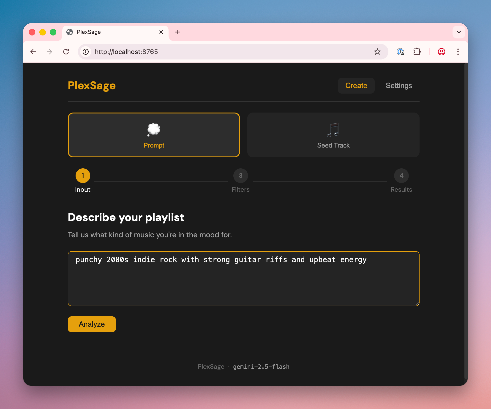
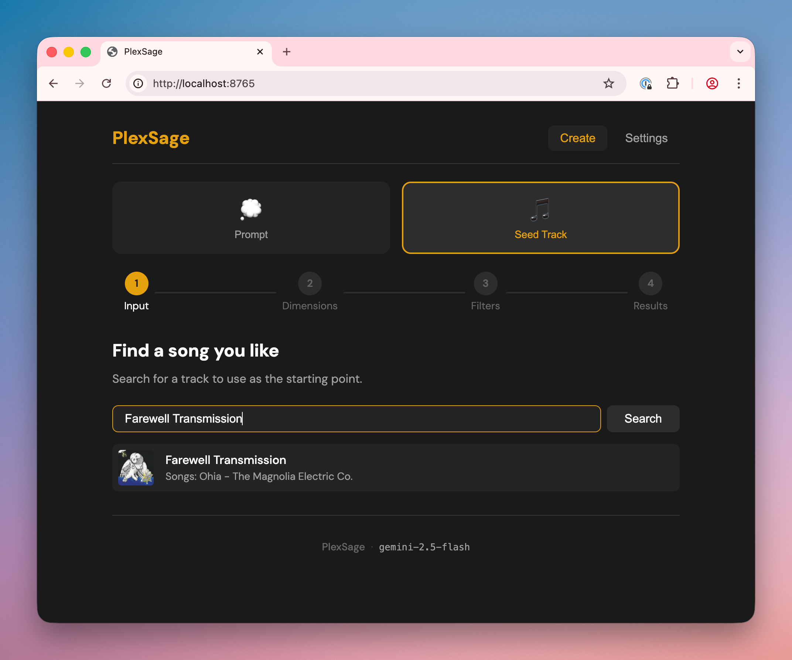
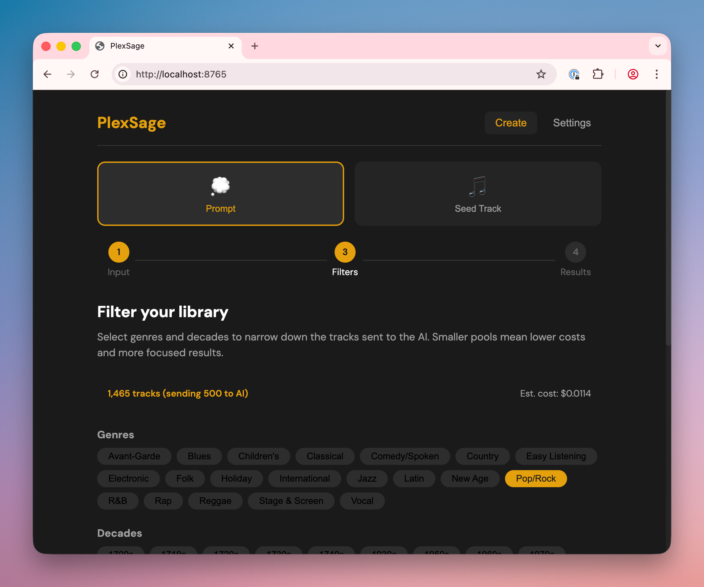
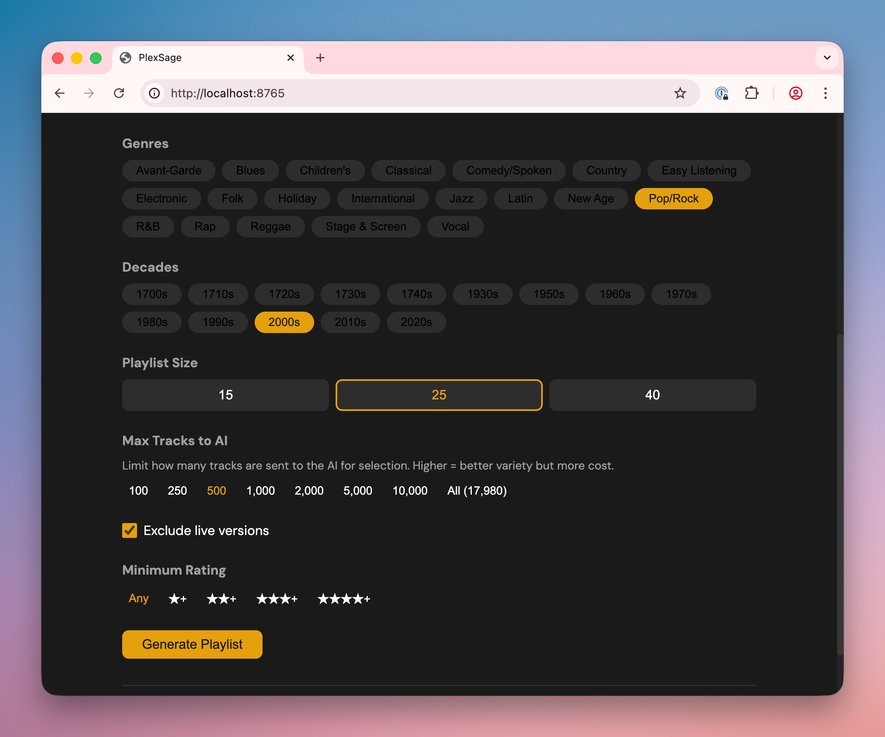
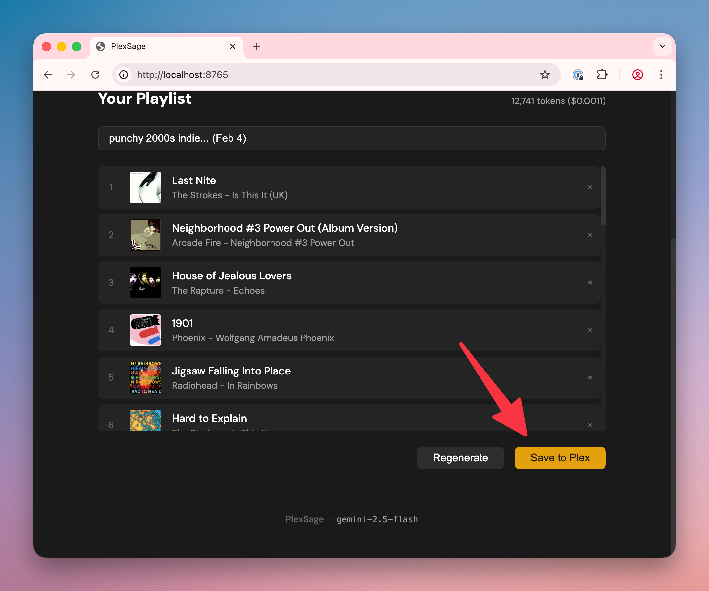

# PlexSage

A self-hosted web application that generates Plex music playlists using LLMs with **actual library awareness**. Unlike other AI playlist tools, PlexSage knows exactly what's in your music library and only suggests tracks you can actually play.

<!--  -->

## Why PlexSage?

**The problem with existing AI playlist tools**: Services like Spotify's AI DJ or third-party tools like SonicSage generate playlists based on what *might* sound good together—but they have no idea what's actually in your library. You end up with playlists full of tracks you don't own, or worse, a frustrating mix of playable and unplayable suggestions.

**PlexSage is different**. It uses a filter-first architecture that:

1. **Starts with your library** — Only tracks you actually own are ever considered
2. **Filters before generating** — Narrow down by genre, decade, and rating before the AI even sees the list
3. **Guarantees 100% playable results** — Every single track in every playlist exists in your Plex library
4. **Scales to large libraries** — Handles 50,000+ track libraries through smart sampling and context management

If you've ever been frustrated by AI recommendations for music you don't have, PlexSage solves that problem.

## Features

### Step 1: Choose How to Start

PlexSage offers two ways to begin creating a playlist:

**Option A: Describe what you want** — Enter a natural language prompt like:
- "Melancholy 90s alternative for a rainy day"
- "Upbeat instrumental jazz for a dinner party"
- "Late night electronic music, nothing too aggressive"

The AI first analyzes your request and suggests appropriate genre and decade filters. Your prompt is saved and sent again later along with the filtered track list for final curation.



**Option B: Start from a song you love** — Search for a track in your library and PlexSage analyzes its musical dimensions: mood, era, instrumentation, genre influences, lyrical themes, and more. Select which dimensions to explore and discover similar music you might have forgotten you owned.



### Step 2: Refine Your Filters

Before the AI sees anything, you control exactly what pool of tracks it can choose from:

- **Genres** — Select one or many from your library's actual genres
- **Decades** — Filter by era (60s, 70s, 80s, etc.)
- **Minimum Rating** — Only include tracks you've rated 3+ stars, 4+ stars, etc.
- **Exclude Live Versions** — Automatically filter out concert recordings

The filter screen shows exactly how many tracks match your selection in real-time.



### Step 3: Control Cost & Variety

Choose how many tracks to send to the AI:

- **Fewer tracks** (100-500) — Lower cost, faster generation, good for focused playlists
- **More tracks** (1,000-5,000) — Higher variety, better for broad requests
- **Maximum** (up to 18,000 with Gemini) — Full library exploration

PlexSage shows estimated cost before you generate. Different LLMs have different limits:
- Gemini: ~18,000 tracks (1M context)
- Claude: ~3,500 tracks (200K context)
- GPT-4: ~2,300 tracks (128K context)

The UI automatically adjusts available options based on your configured model.



### Step 4: Generate & Review

Hit generate and watch the progress indicators as PlexSage:
1. Fetches tracks matching your filters from Plex
2. Sends your original prompt + the filtered track list to the AI
3. AI selects tracks that best match your request
4. Selections are fuzzy-matched back to your library

The AI sees both what you asked for *and* what's available—so it makes informed choices from tracks you actually own. Review your playlist, remove any tracks you don't want, rename it, and see the actual token count and cost for the session.


### Step 5: Save to Plex

One click saves your playlist directly to Plex, ready to play in Plexamp or any Plex client.



---

### Multi-Provider Support

Bring your own API key from any supported provider:

| Provider | Max Tracks | Cost | Notes |
|----------|------------|------|-------|
| **Google Gemini** | ~18,000 | Lowest | Best for large libraries |
| **Anthropic Claude** | ~3,500 | Medium | Nuanced recommendations |
| **OpenAI GPT** | ~2,300 | Medium | Solid all-around |

PlexSage auto-detects your provider based on which API key you configure.

## Quick Start

### Prerequisites

- Docker
- A Plex server with a music library
- [Plex authentication token](https://support.plex.tv/articles/204059436-finding-an-authentication-token-x-plex-token/)
- API key from Anthropic, OpenAI, or Google

### Docker Run

```bash
docker run -d \
  --name plexsage \
  -p 8765:8765 \
  -e PLEX_URL=http://your-plex-server:32400 \
  -e PLEX_TOKEN=your-plex-token \
  -e GEMINI_API_KEY=your-gemini-key \
  --restart unless-stopped \
  ghcr.io/ecwilsonaz/plexsage:latest
```

Then open http://localhost:8765

### Docker Compose

1. Create a directory and download the compose file:
```bash
mkdir plexsage && cd plexsage
curl -O https://raw.githubusercontent.com/ecwilsonaz/plexsage/main/docker-compose.yml
curl -O https://raw.githubusercontent.com/ecwilsonaz/plexsage/main/.env.example
mv .env.example .env
```

2. Edit `.env` with your credentials:
```bash
PLEX_URL=http://your-plex-server:32400
PLEX_TOKEN=your-plex-token

# Choose ONE provider:
GEMINI_API_KEY=your-gemini-key
# ANTHROPIC_API_KEY=sk-ant-your-key
# OPENAI_API_KEY=sk-your-key
```

3. Start:
```bash
docker compose up -d
```

## NAS Deployment

PlexSage is available as a pre-built Docker image: `ghcr.io/ecwilsonaz/plexsage:latest`

### Synology (Container Manager)

**Option A: GUI Setup**

1. Open **Container Manager** → **Registry** → Search for `ghcr.io/ecwilsonaz/plexsage`
2. Download the `latest` tag
3. Go to **Container** → **Create**
4. Configure:
   - **Port**: Local 8765 → Container 8765
   - **Environment**:
     - `PLEX_URL` = `http://your-nas-ip:32400`
     - `PLEX_TOKEN` = your token
     - `GEMINI_API_KEY` = your key (or ANTHROPIC/OPENAI)

**Option B: Docker Compose**

1. SSH into your Synology:
```bash
mkdir -p /volume1/docker/plexsage && cd /volume1/docker/plexsage
curl -O https://raw.githubusercontent.com/ecwilsonaz/plexsage/main/docker-compose.yml
curl -O https://raw.githubusercontent.com/ecwilsonaz/plexsage/main/.env.example
mv .env.example .env
nano .env  # Edit with your credentials
```

2. In **Container Manager** → **Project** → **Create**:
   - Path: `/volume1/docker/plexsage`
   - Source: Use existing docker-compose.yml

### Unraid

1. Go to **Docker** → **Add Container**
2. Configure:
   - **Repository**: `ghcr.io/ecwilsonaz/plexsage:latest`
   - **Port**: 8765 → 8765
   - **Variables**:
     - `PLEX_URL` = `http://your-unraid-ip:32400`
     - `PLEX_TOKEN` = your token
     - `GEMINI_API_KEY` = your key

### TrueNAS SCALE

1. **Apps** → **Discover Apps** → **Custom App**
2. Configure:
   - **Image**: `ghcr.io/ecwilsonaz/plexsage`
   - **Tag**: `latest`
   - **Port**: 8765
   - **Environment Variables**: Add PLEX_URL, PLEX_TOKEN, and your LLM API key

### Portainer

1. **Stacks** → **Add Stack**
2. Paste:
```yaml
services:
  plexsage:
    image: ghcr.io/ecwilsonaz/plexsage:latest
    ports:
      - "8765:8765"
    environment:
      - PLEX_URL=http://your-server:32400
      - PLEX_TOKEN=your-token
      - GEMINI_API_KEY=your-key
    restart: unless-stopped
```

## LLM Providers

PlexSage auto-detects your provider based on which API key is set.

| Provider | Models | Max Tracks | Cost | Notes |
|----------|--------|------------|------|-------|
| **Gemini** | gemini-2.5-flash | ~18,000 | Lowest | Great for large libraries |
| **Anthropic** | claude-sonnet-4-5, claude-haiku-4-5 | ~3,500 | Medium | Nuanced recommendations |
| **OpenAI** | gpt-4.1, gpt-4.1-mini | ~2,300 | Medium | Solid all-around choice |

### Two-Model Strategy

PlexSage uses two models by default:
- **Analysis model** (smarter): Understands your prompt, suggests filters, analyzes seed tracks
- **Generation model** (cheaper): Selects tracks from the filtered list

This balances quality and cost. Set `smart_generation: true` in config to use the analysis model for everything (higher quality, ~3-5x cost).

## Configuration

### Environment Variables

| Variable | Description |
|----------|-------------|
| `PLEX_URL` | Your Plex server URL |
| `PLEX_TOKEN` | Plex authentication token |
| `PLEX_MUSIC_LIBRARY` | Music library name (default: "Music") |
| `LLM_PROVIDER` | anthropic, openai, or gemini (auto-detected if not set) |
| `ANTHROPIC_API_KEY` | Anthropic API key |
| `OPENAI_API_KEY` | OpenAI API key |
| `GEMINI_API_KEY` | Google Gemini API key |

### Optional: config.yaml

For additional customization, mount a config file:

```yaml
plex:
  music_library: "Music"

llm:
  provider: "gemini"
  model_analysis: "gemini-2.5-flash"
  model_generation: "gemini-2.5-flash"
  smart_generation: false

defaults:
  track_count: 25
```

## How It Works

PlexSage uses a **filter-first architecture** to handle large libraries:

1. **Analyze**: LLM interprets your prompt and suggests genre/decade filters
2. **Filter**: Library is narrowed to matching tracks (e.g., "90s Alternative" → 2,000 tracks)
3. **Sample**: If still too large, randomly samples tracks to fit context limits
4. **Generate**: Filtered track list sent to LLM for curation
5. **Match**: LLM selections are fuzzy-matched back to your library
6. **Save**: Playlist is created in Plex

This ensures every track exists in your library while keeping costs manageable for 50,000+ track libraries.

## Development

### Local Setup

```bash
git clone https://github.com/ecwilsonaz/plexsage.git
cd plexsage

python -m venv venv
source venv/bin/activate

pip install -r requirements.txt

# Set environment variables (or use .env file)
export PLEX_URL=http://your-plex-server:32400
export PLEX_TOKEN=your-plex-token
export GEMINI_API_KEY=your-key

uvicorn backend.main:app --reload --port 8765
```

### Running Tests

```bash
pytest tests/ -v
```

## API

Interactive API documentation available at `/docs` when running.

Key endpoints:
- `GET /api/health` - Health check
- `GET /api/config` - Current configuration
- `GET /api/library/stats` - Library statistics
- `POST /api/analyze/prompt` - Analyze natural language prompt
- `POST /api/generate` - Generate playlist
- `POST /api/playlist` - Save playlist to Plex

## Tech Stack

- **Backend**: Python 3.11+, FastAPI, python-plexapi, rapidfuzz
- **Frontend**: Vanilla HTML/CSS/JS (no build step)
- **LLM SDKs**: anthropic, openai, google-generativeai
- **Deployment**: Docker

## License

MIT
