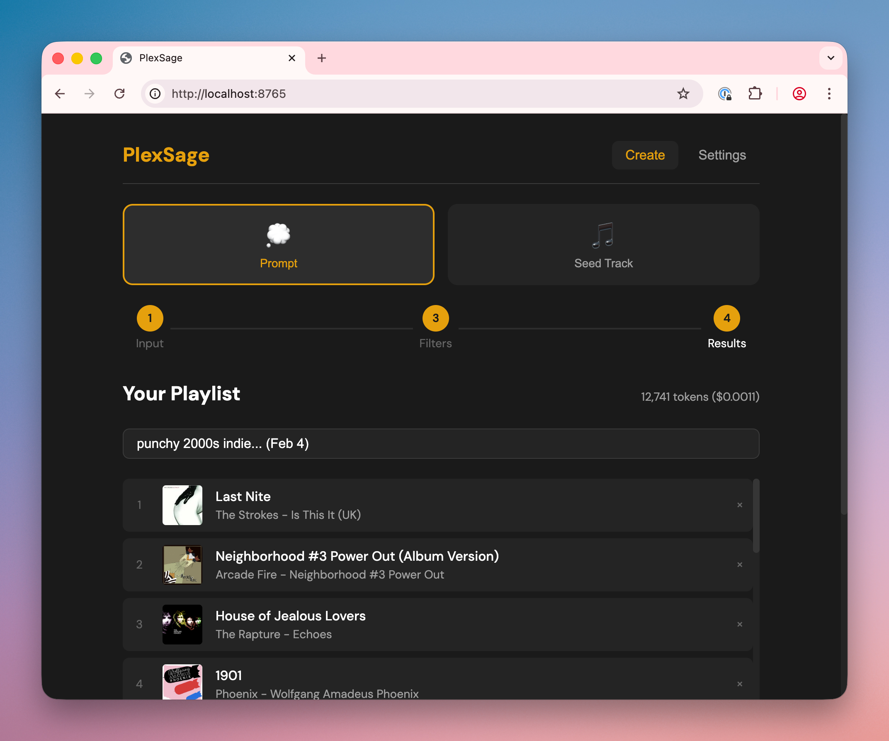

# MediaSage for Plex

[](https://opensource.org/licenses/MIT)
[](https://ghcr.io/ecwilsonaz/mediasage)
[](https://www.python.org/downloads/)

**AI-powered playlist generation for Plex—using only tracks you actually own.**

MediaSage is a self-hosted web app that creates music playlists by combining LLM intelligence with your Plex library. Every track it suggests is guaranteed playable because it only considers music you have.



## Demo

### Prompt-Based Flow
Describe what you want in natural language, refine filters, and generate a playlist:


### Seed-Based Flow
Start from a song you love and explore its musical dimensions:


---

## Quick Start

```bash
docker run -d \
  --name mediasage \
  -p 5765:5765 \
  -e PLEX_URL=http://your-plex-server:32400 \
  -e PLEX_TOKEN=your-plex-token \
  -e GEMINI_API_KEY=your-gemini-key \
  --restart unless-stopped \
  ghcr.io/ecwilsonaz/mediasage:latest
```

Open **http://localhost:5765** and start creating playlists.

**Requirements:** Docker, a Plex server with music, a [Plex token](https://support.plex.tv/articles/204059436-finding-an-authentication-token-x-plex-token/), and an API key from Google, Anthropic, or OpenAI.

---

## Contents

- [Demo](#demo)
- [Why MediaSage?](#why-mediasage)
- [Features](#features)
- [Installation](#installation)
- [Configuration](#configuration)
- [How It Works](#how-it-works)
- [Development](#development)
- [API Reference](#api-reference)

---

## Why MediaSage?

**Plex users with personal music libraries have few good options for AI playlists.**

Plexamp's built-in Sonic Sage used ChatGPT to generate playlists, but it was designed around Tidal streaming. The AI recommended tracks from an unlimited catalog, and Tidal made them playable. The "limit to library" setting just hid results you didn't own—so if you asked for 25 tracks and only 4 existed in your library, you got a 4-track playlist.

When [Tidal integration ended in October 2024](https://forums.plex.tv/t/tidal-integration-with-plex-ending-october-28-2024/885728), Sonic Sage lost its foundation. Generic tools like ChatGPT have the same problem: they recommend from an infinite catalog with no awareness of what you actually own.

**MediaSage inverts the approach:**

| Filter-Last (Sonic Sage, ChatGPT) | Filter-First (MediaSage) |
|-----------------------------------|-------------------------|
| AI recommends from infinite catalog | AI only sees your library |
| Hide missing tracks after | No missing tracks possible |
| Near-empty playlists | Full playlists, every time |

The result: every track in every playlist exists in your Plex library and plays immediately.

---

## Features

### Two Ways to Start

**Describe what you want** — Natural language prompts like:
- "Melancholy 90s alternative for a rainy day"
- "Upbeat instrumental jazz for a dinner party"
- "Late night electronic, nothing too aggressive"

**Start from a song** — Pick a track you love, then explore musical dimensions: mood, era, instrumentation, genre, production style. Select which qualities you want more of.

### Smart Filtering

Before the AI sees anything, you control the pool:
- **Genres** — Select from your library's actual genre tags
- **Decades** — Filter by era
- **Minimum rating** — Only tracks rated 3+, 4+, etc.
- **Exclude live versions** — Skip concert recordings automatically

Real-time track counts show exactly how your filters narrow results.

### Cost Control

Choose how many tracks to send to the AI:

| Track Count | Use Case | Typical Cost |
|-------------|----------|--------------|
| 100–500 | Focused playlists, quick generation | Pennies |
| 1,000–5,000 | Broad requests, more variety | Cents |
| Up to 18,000 | Full library exploration (Gemini only) | Under $0.50 |

Estimated cost displays before you generate. No surprises.

### Multi-Provider Support

Bring your own API key—or run locally:

| Provider | Max Tracks | Best For |
|----------|------------|----------|
| **Google Gemini** | ~18,000 | Large libraries, lowest cost |
| **Anthropic Claude** | ~3,500 | Nuanced recommendations |
| **OpenAI GPT** | ~2,300 | Solid all-around |
| **Ollama** ⚗️ | Varies by model | Privacy, no API costs |
| **Custom** ⚗️ | Configurable | Self-hosted, OpenAI-compatible APIs |

⚗️ *Local LLM support is experimental. [Report issues](https://github.com/ecwilsonaz/mediasage/issues).*

MediaSage auto-detects your provider based on which key you configure.

### Review and Save

- Preview tracks with album art before saving
- Remove tracks you don't want
- Rename the playlist
- See actual token usage and cost
- One-click save to Plex

---

## Installation

### Docker Compose (Recommended)

```bash
mkdir mediasage && cd mediasage
curl -O https://raw.githubusercontent.com/ecwilsonaz/mediasage/main/docker-compose.yml
curl -O https://raw.githubusercontent.com/ecwilsonaz/mediasage/main/.env.example
mv .env.example .env
```

Edit `.env`:

```bash
PLEX_URL=http://your-plex-server:32400
PLEX_TOKEN=your-plex-token

# Choose ONE provider:
GEMINI_API_KEY=your-gemini-key
# ANTHROPIC_API_KEY=sk-ant-your-key
# OPENAI_API_KEY=sk-your-key
```

Start:

```bash
docker compose up -d
```

### NAS Platforms

<details>
<summary><strong>Synology (Container Manager)</strong></summary>

**GUI:**
1. **Container Manager** → **Registry** → Search `ghcr.io/ecwilsonaz/mediasage`
2. Download `latest` tag
3. **Container** → **Create**
4. Port: 5765 → 5765
5. Add environment variables: `PLEX_URL`, `PLEX_TOKEN`, `GEMINI_API_KEY`

**Docker Compose:**
```bash
mkdir -p /volume1/docker/mediasage && cd /volume1/docker/mediasage
curl -O https://raw.githubusercontent.com/ecwilsonaz/mediasage/main/docker-compose.yml
curl -O https://raw.githubusercontent.com/ecwilsonaz/mediasage/main/.env.example
mv .env.example .env && nano .env
```
Then in **Container Manager** → **Project** → **Create**, point to `/volume1/docker/mediasage`.

</details>

<details>
<summary><strong>Unraid</strong></summary>

1. **Docker** → **Add Container**
2. Repository: `ghcr.io/ecwilsonaz/mediasage:latest`
3. Port: 5765 → 5765
4. Add variables: `PLEX_URL`, `PLEX_TOKEN`, `GEMINI_API_KEY`

</details>

<details>
<summary><strong>TrueNAS SCALE</strong></summary>

1. **Apps** → **Discover Apps** → **Custom App**
2. Image: `ghcr.io/ecwilsonaz/mediasage`, Tag: `latest`
3. Port: 5765
4. Add environment variables

</details>

<details>
<summary><strong>Portainer</strong></summary>

**Stacks** → **Add Stack**:

```yaml
services:
  mediasage:
    image: ghcr.io/ecwilsonaz/mediasage:latest
    ports:
      - "5765:5765"
    environment:
      - PLEX_URL=http://your-server:32400
      - PLEX_TOKEN=your-token
      - GEMINI_API_KEY=your-key
    restart: unless-stopped
```

</details>

---

## Configuration

### Environment Variables

| Variable | Required | Description |
|----------|----------|-------------|
| `PLEX_URL` | Yes | Plex server URL (e.g., `http://192.168.1.100:32400`) |
| `PLEX_TOKEN` | Yes | [Plex authentication token](https://support.plex.tv/articles/204059436-finding-an-authentication-token-x-plex-token/) |
| `GEMINI_API_KEY` | One required | Google Gemini API key |
| `ANTHROPIC_API_KEY` | One required | Anthropic API key |
| `OPENAI_API_KEY` | One required | OpenAI API key |
| `LLM_PROVIDER` | No | Force provider: `gemini`, `anthropic`, `openai`, `ollama`, `custom` |
| `PLEX_MUSIC_LIBRARY` | No | Library name if not "Music" |
| `OLLAMA_URL` | No | Ollama server URL (default: `http://localhost:11434`) |
| `OLLAMA_CONTEXT_WINDOW` | No | Override detected context window for Ollama (default: 32768) |
| `CUSTOM_LLM_URL` | No | Custom OpenAI-compatible API base URL |
| `CUSTOM_LLM_API_KEY` | No | API key for custom provider (if required) |
| `CUSTOM_CONTEXT_WINDOW` | No | Context window size for custom provider (default: 32768) |

### Web UI Configuration

You can also configure MediaSage through the **Settings** page in the web UI. Settings entered there are saved to `config.user.yaml` and persist across restarts. Environment variables always take priority over UI-saved settings.

### Advanced: config.yaml

Mount a config file for additional options:

```yaml
plex:
  music_library: "Music"

llm:
  provider: "gemini"
  model_analysis: "gemini-2.5-flash"
  model_generation: "gemini-2.5-flash"
  smart_generation: false  # true = use smarter model for both (higher quality, ~3-5x cost)

defaults:
  track_count: 25
```

### Model Selection

MediaSage uses a two-model strategy by default:

| Role | Purpose | Models Used |
|------|---------|-------------|
| **Analysis** | Interpret prompts, suggest filters, analyze seed tracks | claude-sonnet-4-5 / gpt-4.1 / gemini-2.5-flash |
| **Generation** | Select tracks from filtered list | claude-haiku-4-5 / gpt-4.1-mini / gemini-2.5-flash |

This balances quality with cost. Enable `smart_generation: true` to use the analysis model for everything.

### Local LLM Setup (Experimental)

Run MediaSage with local models for privacy and zero API costs.

<details>
<summary><strong>Ollama</strong></summary>

1. Install [Ollama](https://ollama.ai) and pull a model:
   ```bash
   ollama pull llama3:8b
   ```

2. Configure MediaSage via environment or Settings UI:
   ```bash
   LLM_PROVIDER=ollama
   OLLAMA_URL=http://localhost:11434
   ```

3. Select your model in Settings → the context window is auto-detected.

**Recommended models:** `llama3:8b`, `qwen3:8b`, `mistral` — models with 8K+ context work best.

</details>

<details>
<summary><strong>Custom OpenAI-Compatible API</strong></summary>

For LM Studio, text-generation-webui, vLLM, or any OpenAI-compatible server:

1. Start your server with an OpenAI-compatible endpoint

2. Configure in Settings:
   - **API Base URL:** `http://localhost:5000/v1`
   - **API Key:** If required by your server
   - **Model Name:** The model identifier
   - **Context Window:** Your model's context size

</details>

**Note:** Local models are slower and may produce less accurate results than cloud providers. A 10-minute timeout is used for generation. Models with larger context windows will support more tracks.

---

## How It Works

MediaSage uses a **filter-first architecture** designed for large libraries (50,000+ tracks):

```
┌─────────────────────────────────────────────────────────────────┐
│  1. ANALYZE                                                      │
│     LLM interprets your prompt → suggests genre/decade filters   │
├─────────────────────────────────────────────────────────────────┤
│  2. FILTER                                                       │
│     Plex library narrowed to matching tracks                     │
│     "90s Alternative" → 2,000 tracks                             │
├─────────────────────────────────────────────────────────────────┤
│  3. SAMPLE                                                       │
│     If too large for context, randomly sample                    │
│     Fits within model's token limits                             │
├─────────────────────────────────────────────────────────────────┤
│  4. GENERATE                                                     │
│     Filtered track list + prompt sent to LLM                     │
│     LLM selects best matches from available tracks               │
├─────────────────────────────────────────────────────────────────┤
│  5. MATCH                                                        │
│     Fuzzy matching links LLM selections to library               │
│     Handles minor spelling/formatting differences                │
├─────────────────────────────────────────────────────────────────┤
│  6. SAVE                                                         │
│     Playlist created in Plex                                     │
│     Ready in Plexamp or any Plex client                          │
└─────────────────────────────────────────────────────────────────┘
```

This ensures every track exists in your library while keeping API costs manageable.

---

## Development

### Local Setup

```bash
git clone https://github.com/ecwilsonaz/mediasage.git
cd mediasage
python -m venv venv
source venv/bin/activate
pip install -r requirements.txt

export PLEX_URL=http://your-plex-server:32400
export PLEX_TOKEN=your-plex-token
export GEMINI_API_KEY=your-key

uvicorn backend.main:app --reload --port 5765
```

### Testing

```bash
pytest tests/ -v
```

### Tech Stack

- **Backend:** Python 3.11+, FastAPI, python-plexapi, rapidfuzz, httpx
- **Frontend:** Vanilla HTML/CSS/JS (no build step)
- **LLM SDKs:** anthropic, openai, google-genai (+ Ollama via REST API)
- **Deployment:** Docker

---

## API Reference

Interactive documentation available at `/docs` when running.

| Endpoint | Method | Description |
|----------|--------|-------------|
| `/api/health` | GET | Health check |
| `/api/config` | GET/POST | Get or update configuration |
| `/api/library/stats` | GET | Library statistics |
| `/api/analyze/prompt` | POST | Analyze natural language prompt |
| `/api/generate` | POST | Generate playlist |
| `/api/playlist` | POST | Save playlist to Plex |
| `/api/ollama/status` | GET | Ollama connection status |
| `/api/ollama/models` | GET | List available Ollama models |
| `/api/ollama/model-info` | GET | Get model details (context window) |

---

## License

MIT
